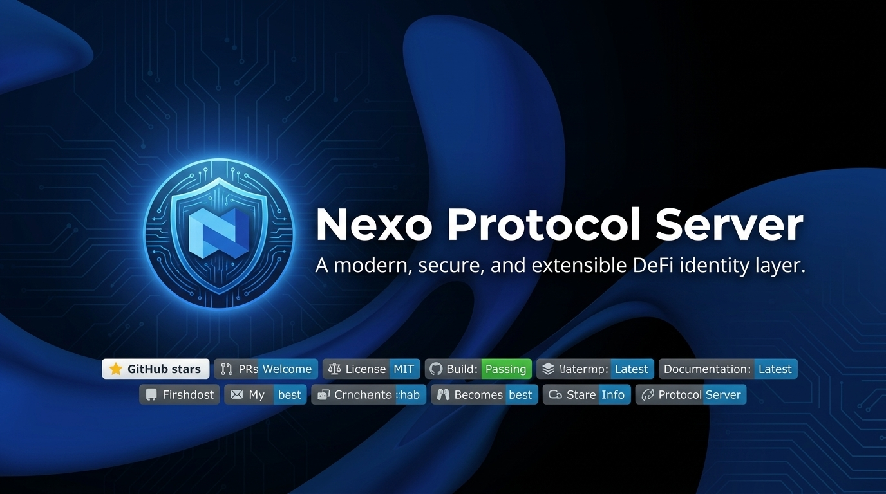
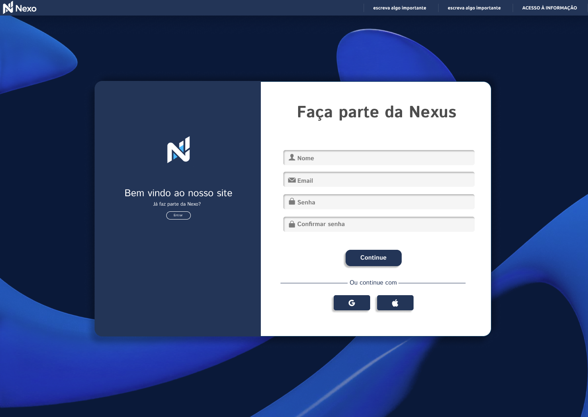
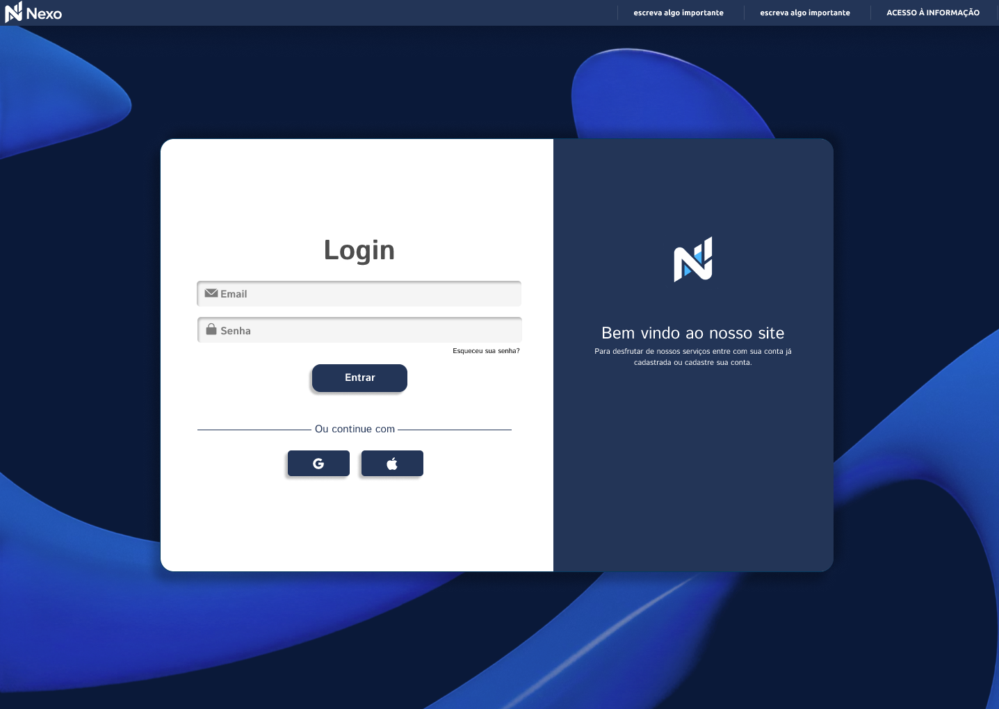
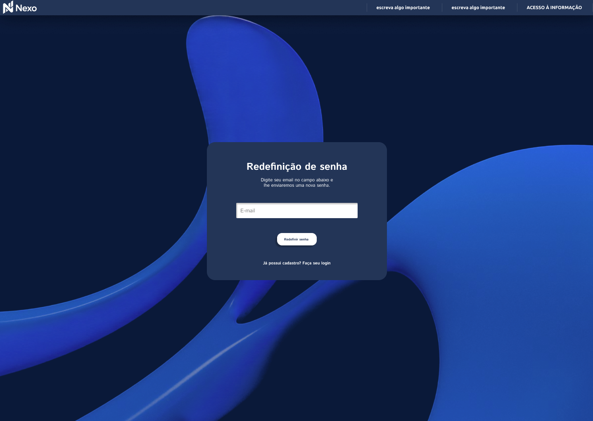
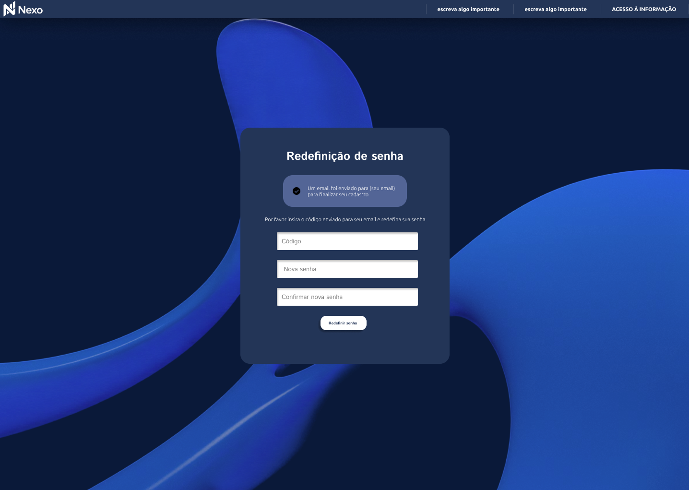

<div id="topo"></div>

<div align="center">
  
</div>

<br>

<div align="center">
  <a href="https://github.com/seu-usuario/projeto-nexo">
    
  </a>
  <a href="https://github.com/seu-usuario/projeto-nexo">
    
  </a>
  <a href="https://github.com/seu-usuario/projeto-nexo">
    
  </a>
  <a href="https://github.com/seu-usuario/projeto-nexo">
    
  </a>
  <a href="https://github.com/seu-usuario/projeto-nexo">
    
  </a>
  <a href="https://github.com/seu-usuario/projeto-nexo">
    
  </a>
  <a href="https://github.com/seu-usuario/projeto-nexo">
    
  </a>
</div>

<br>

<div align="center">
  
  
  
  
  
  
</div>

<div align="center">
  <br>
  <b>Apoie nosso projeto compartilhando:</b><br>
  <br>
  <a href="https://twitter.com/intent/tweet?text=Confira%20o%20Projeto%20Nexo&url=https://github.com/seu-usuario/projeto-nexo">
    
  </a>
  <a href="https://www.linkedin.com/sharing/share-offsite/?url=https://github.com/seu-usuario/projeto-nexo">
    
  </a>
  <a href="https://www.facebook.com/sharer/sharer.php?u=https://github.com/seu-usuario/projeto-nexo">
    
  </a>
  <a href="https://reddit.com/submit?url=https://github.com/seu-usuario/projeto-nexo&title=Projeto%20Nexo">
    
  </a>
  <a href="https://t.me/share/url?url=https://github.com/seu-usuario/projeto-nexo&text=Confira%20o%20Projeto%20Nexo">
    
  </a>
</div>

<br>

<details>
  <summary>Tabela de Conteudos</summary>
  <ul>
    <li><a href="#visao-geral">Visão Geral</a></li>
    <li><a href="#telas-do-projeto">Telas do Projeto</a></li>
    <li><a href="#tecnologias-e-arquitetura">Tecnologias e Arquitetura</a></li>
    <li><a href="#equipe">Equipe</a></li>
    <li><a href="#como-rodar">Como Rodar</a></li>
  </ul>
</details>

---

<h2 id="visao-geral">Visão Geral</h2>

O Projeto Nexo é um sistema voltado para a área de Perícia Computacional. O foco principal é aliar alta performance com simplicidade acadêmica, fornecendo uma plataforma robusta para a análise e a emissão de relatórios forenses. O sistema visa facilitar o trabalho de peritos e investigadores, oferecendo ferramentas ágeis para visualização de logs, métricas e consolidação de dados de forma intuitiva e eficiente.

> [!IMPORTANT]
> A modelagem inicial do banco prevê quatro tabelas centrais: Usuários, Logs, Projetos_Periciais e Relatórios.

<p align="right"><a href="#topo">voltar ao topo</a></p>

---

<h2 id="telas-do-projeto">Telas do Projeto</h2>

<div align="center">
  
  
  
  
</div>

<br>

O sistema consistirá em pelo menos quatro telas obrigatórias:

1. **Autenticação:** Cadastro "Faça parte da Nexus", Login, Recuperação de Senha com E-mail e Inserção de Código de Segurança.
2. **Dashboard:** Tela de Métricas Forenses.
3. **Logs:** Terminal e Grid de Logs em tempo real.
4. **Relatório:** Tela de Relatório Final.

<p align="right"><a href="#topo">voltar ao topo</a></p>

---

<h2 id="tecnologias-e-arquitetura">Tecnologias e Arquitetura</h2>

A escolha da stack tecnológica foi baseada na necessidade de desempenho, segurança e facilidade de manutenção para o ecossistema pericial:

* **Frontend:** Vue.js 3 com Vite. Garantem uma interface reativa, construção rápida e excelente experiência de usuário para as visualizações de dados.
* **Backend:** Python com FastAPI. O FastAPI oferece alta performance e documentação nativa via Swagger, ideal para agilizar o desenvolvimento e o teste das rotas da API.
* **Banco de Dados:** SQL. A flexibilidade permite o uso de SQLite para ambientes de desenvolvimento e PostgreSQL para produção.

<p align="right"><a href="#topo">voltar ao topo</a></p>

---

<h2 id="equipe">Equipe</h2>

A equipe responsável pelo desenvolvimento e documentação do Projeto Nexo é composta por:

| Nome | Matrícula | Função |
|---|---|---|
| Luann Thayller | 0023194 | Gerente de Projeto, Desenvolvedor Front-End e UI/UX Designer |
| Gabriel Nonato | 0020241 | Desenvolvedor FullStack |
| Weney Anjos da Silva | 0023218 | Desenvolvedor Back-End e Data Engineer |
| Luísa Damaceno | 0016112 | Analista de Requisitos |
| Gabryel Henrique | 0022470 | Assistente Administrativo |
| Érica Beatriz de A. | 0022515 | Analista de Requisitos e UI/UX Designer |

<p align="right"><a href="#topo">voltar ao topo</a></p>

---

<h2 id="como-rodar">Como Rodar</h2>

Siga os passos abaixo para configurar e executar o projeto em seu ambiente local:

```bash
# Abra o terminal

# Clone o repositorio
git clone https://github.com/seu-usuario/projeto-nexo.git

# Navegue ate a pasta do projeto
cd projeto-nexo

# Instale as dependencias do backend
comando_de_instalacao_backend_aqui

# Instale as dependencias do frontend
comando_de_instalacao_frontend_aqui

# Inicie o servidor do backend
comando_para_iniciar_backend_aqui

# Inicie o servidor do frontend
comando_para_iniciar_frontend_aqui
```

<p align="right"><a href="#topo">voltar ao topo</a></p>
